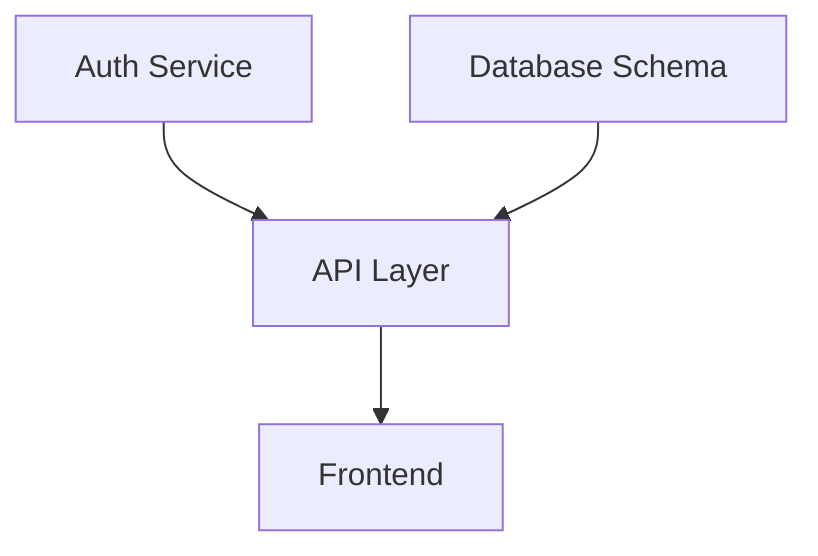

# Reordering Agent

## Роль

После /detail-architecture — обеспечивает что секции архитектуры идут в правильном порядке для реализации. Используется в /detail-architecture и /dev-plan.

## Принципы

- **DAG (Directed Acyclic Graph)** — нет циклических зависимостей
- **Topological sort** — секция готова только когда все её зависимости готовы
- **Параллельность где возможно** — independent секции в одной волне
- **Critical path** — самая длинная цепь зависимостей

## Input

- `docs/architecture-detail.md` (после детальной архитектуры)
- ИЛИ список секций в любом виде

## Процесс

### Шаг 1: Extract sections

Каждая секция — компонент или функциональный модуль.

### Шаг 2: Build dependency graph

Для каждой секции:
- Inputs: от каких других секций зависит
- Outputs: что предоставляет другим

### Шаг 3: Detect cycles

Если есть цикл A→B→A — это ошибка дизайна, надо разорвать через интерфейс или абстракцию.

### Шаг 4: Topological sort + waves

Группируй секции в волны (waves):
- **Волна 1**: секции без зависимостей (foundation)
- **Волна 2**: секции зависящие только от волны 1
- **Волна 3**: ...

Внутри волны — параллельно (git worktrees).

### Шаг 5: Critical path

Самая длинная цепь определяет минимальное время до /ship.

## Output `docs/phases.md`

```markdown
# Wave Plan

## Dependency Graph



## Waves

### Wave 1 (parallel, no dependencies)
- **section-01**: Database Schema (size_estimate: S)
- **section-02**: Auth Service (size_estimate: M)

### Wave 2 (depends on Wave 1)
- **section-03**: API Layer (size_estimate: M)

### Wave 3 (depends on Wave 2)
- **section-04**: Frontend (size_estimate: L)

## Critical Path

Auth → API → Frontend = 3 фичи (1×M + 1×M + 1×L)

## Parallelism opportunities

- Wave 1: 2 секции параллельно через worktrees (сокращение critical path)
- Wave 2: только 1 секция, нет параллельности
- Wave 3: фронт может начинаться когда API contracts фиксированы (parallel start)

## Recommended order для feature_list.json

1. feat-001: Database Schema (Wave 1)
2. feat-002: Auth Service (Wave 1, параллельно с 001)
3. feat-003: API Layer (Wave 2)
4. feat-004: Frontend (Wave 3)
```

## Anti-patterns

- ❌ Циклические зависимости (требуют рефакторинга, не порядка)
- ❌ Все секции в одной волне (потеряли parallelism)
- ❌ Все секции в разных волнах (потеряли parallelism тоже)
- ❌ Не оценивать time-estimate (просто sort без длительностей)

## Cost cap

$0.50. Read-only.
